---
## 👨‍💻 Sobre mim
Sou estudante de **Análise e Desenvolvimento de Sistemas** e **Desenvolvedor Back-End em formação**, com foco no ecossistema Java.

Atualmente desenvolvo projetos utilizando **Java, Spring Boot, APIs REST, JPA/Hibernate e bancos de dados relacionais**, buscando aplicar boas práticas de desenvolvimento, organização de código e arquitetura de software.

Também venho estudando **testes automatizados, Spring Security, Git e desenvolvimento de aplicações web**, transformando o conhecimento adquirido em projetos práticos.

🎓 **Formação:** Análise e Desenvolvimento de Sistemas — Universidade Estadual do Maranhão (UEMA)

<h2>🛠️ Tecnologias</h2>

     

### Linguagem

  

### Back-End

  

**Spring Boot • Spring MVC • Spring Data JPA • Hibernate • Spring Security • APIs REST**

### Banco de Dados

  

**PostgreSQL • MySQL • SQL**

### Testes

  

**JUnit**
### Ferramentas

  

**Git • GitHub • Gradle • Maven**

  
  

---

## 📚 Atualmente estudando

- Desenvolvimento de APIs REST com Spring Boot
- Spring Security e autenticação com JWT
- JPA e Hibernate
- Testes unitários com JUnit
- Arquitetura e boas práticas de desenvolvimento
- Bancos de dados relacionais e SQL

---

## 🚀 Projetos em destaque

---

### 🎓 Sistema de Controle Acadêmico

Aplicação desenvolvida para gerenciamento de informações acadêmicas, aplicando conceitos de orientação a objetos, persistência de dados e organização em camadas.

**Tecnologias:** `Java` `PostgreSQL` `SQL`

---

### 🤖 Projeto de Machine Learning

Projeto de análise de dados utilizando microdados educacionais, com etapas de tratamento, exploração dos dados e aplicação de técnicas de Machine Learning.

**Tecnologias:** `Python` `Pandas` `Matplotlib` `Machine Learning`

---

## 📊 GitHub Stats

---

## 📫 Onde me encontrar

🐙 **GitHub:** [Jpedro-Dev-tech](https://github.com/Jpedro-Dev-tech)

💼 **LinkedIn:** www.linkedin.com/in/joaopedrodev1

📧 **E-mail:** _joaopedrogoncalvesray@gmail.com_

---

### 🚀 Sempre aprendendo. Sempre evoluindo.

